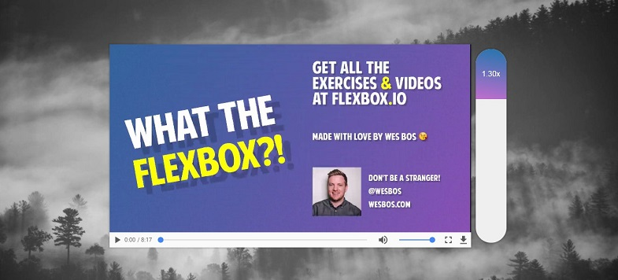

## JavaScript30 Day 28 - Video Speed Controller UI

In this tutorial, we learn how to build an UI that allows users to control video speed by scrubbing a pill like control.

[View demo site here.](https://webdevtuts.github.io/javascript30_28/)

